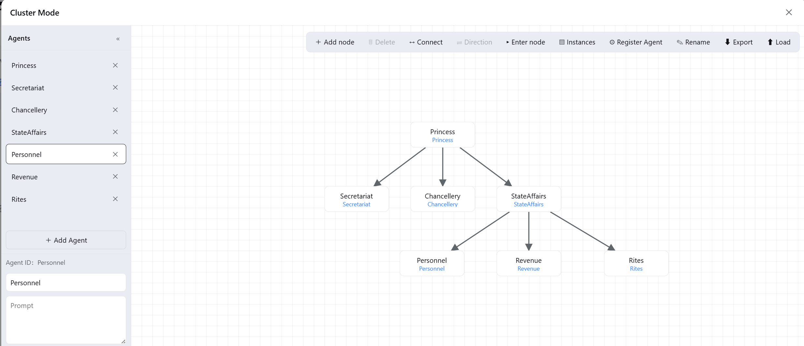
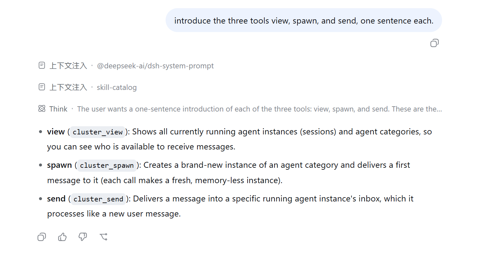

# DSH Cluster Plugin

Cluster mode for **DeepSeek Harness** — a canvas node-graph for orchestrating multi-agent collaboration and information flow. Every node is an agent (with its own name, persona, and mode); the **directed edges** between nodes decide who can message whom.

[中文文档](README.zh.md)

## The canvas



## The three tools



- **`cluster_view`** — shows all running agent instances (sessions) and agent categories, so you can see who is available to receive messages.
- **`cluster_spawn`** — creates a brand-new instance of an agent category and delivers a first message to it (each call makes a fresh, memory-less instance).
- **`cluster_send`** — delivers a message into a specific running instance's inbox, which it processes like a new user message.

## Features

- **Canvas node-graph** — add nodes, connect edges (one-way / two-way / none), bind agents, rename.
- **Agent management** — each agent has a `name`, `prompt` (persona), `mode`, and optional `space`; auto-saved to `$DSH_HOME/cluster-agents/<id>/agent.json`.
- **Information-flow constraints** — edges are directed and deny-by-default: only declared flows may `cluster_send`/`cluster_spawn`; an empty graph is fully open.
- **Three agent modes**:
  - `single` — address it with `cluster_send` (its most recent running session).
  - `multi` — address it with `cluster_spawn` (a fresh instance each time).
  - `any` — either.
- **Export / load** — export the graph **and** agent properties together (`.txt` JSON, v2), then load them elsewhere to restore agents and write them back to disk.
- **Identity space** — optionally attach a disk directory to an agent; its persona is told to browse that space first. Since the Agent panel on the canvas is intentionally simple, richer materials — Skills, scripts, long-term memory, personality files, `agent.md`, etc. — can live in each agent's own space.

## Install

Prerequisite: the profile already has the official `@deepseek-ai/dsh-base` + `@deepseek-ai/dsh-web-app` bundles.

```sh
dsh plugin --profile web add @lanxi266/dsh-cluster-plugin
```

Start it:

```sh
dsh --profile web web   # or `dsh web`
```

## Quick start

1. Open dsh web and click the **cluster icon** in the bottom-left corner to open the canvas.
2. In the **Agents** bar, **add an agent** (e.g. id `math_teacher`), give it a name and persona, pick a mode.
3. Double-click the canvas to **add a node**, **bind** it to an agent, then **connect** nodes (drag A → B means A can message B).
4. **Enter a node**: the agent receives your persona plus a workflow hint, and uses `cluster_view` / `cluster_send` / `cluster_spawn` to collaborate.
5. The last link (whose `cluster_view` shows only itself) is told to produce the final result directly, so the pipeline terminates.

## How information flows

- An **edge = an allowed flow**. `A → B` means A can message B; B cannot message A back (unless the edge is two-way).
- `cluster_view` only shows **yourself + your downstream**, so a downstream agent cannot see upstream — it can only pass messages further down.
- No edges = fully open (handy to try things out before adding constraints).

## Packages

| Package | Role |
|---|---|
| `@lanxi266/dsh-cluster-agent-fs` | Host filesystem service: reads/writes `agent.json`, persists the graph, exposes the Remote endpoints |
| `@lanxi266/dsh-tool-cluster` | Host tools: `cluster_view` / `cluster_send` / `cluster_spawn` + persona injection |
| `@lanxi266/dsh-client-ui-cluster` | Browser canvas: cluster icon, node-graph, agent editor |
| `@lanxi266/dsh-cluster-plugin` | **bundle**: just a `cordis.patch.yml` that inserts the three rows above into a profile |

## Requirements

- Node ≥ 22.19 (official DSH requirement)
- Official DSH runtime: `@deepseek-ai/dsh-base`, `@deepseek-ai/dsh-web-app` (the `@deepseek-ai/dsh-*` series is provided by DSH itself)

## License

MIT

## Note

The author is a Java programmer, so this project was completed by **DeepSeek-V4-Pro-High**, costing **36.62 RMB / 5.39 USD** (before the price increase). There may be many bugs — please be understanding, and feel free to fix bugs locally with **Vibe-Coding**. This project is open-sourced under the **MIT** license.
