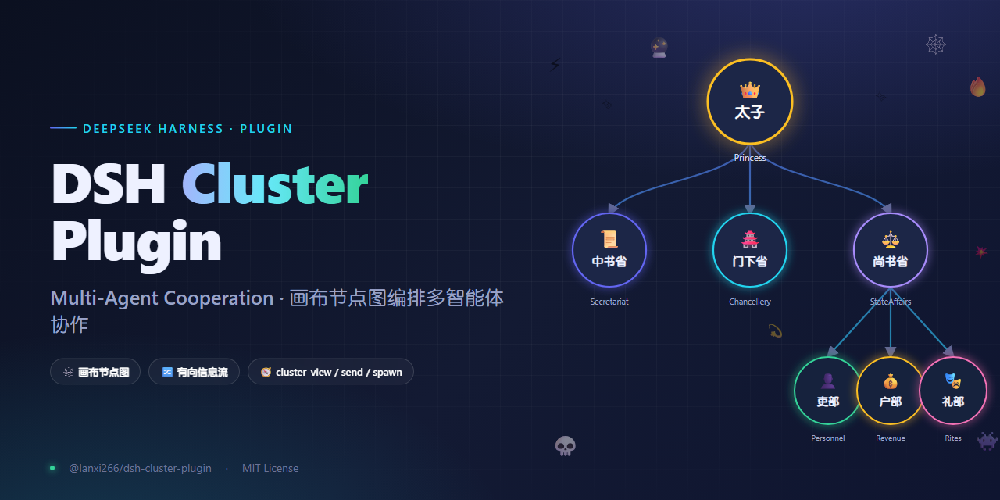
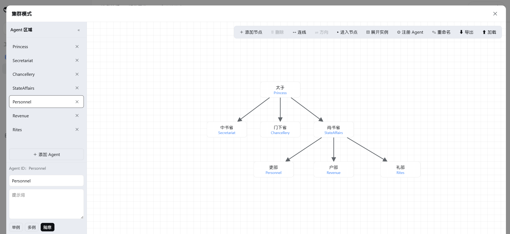
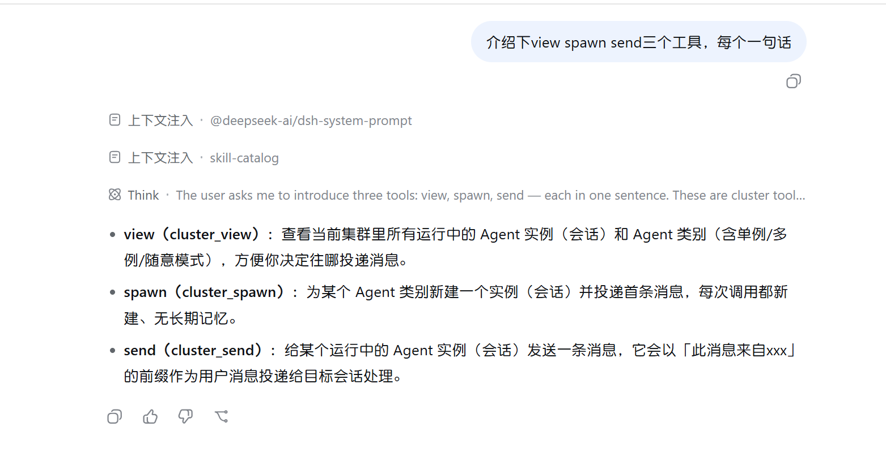

# DSH Cluster Plugin

DeepSeek Harness 的**集群模式**插件：用一个画布式节点图来编排多个 AI Agent 的协作与信息流。每个节点是一个 Agent（有自己的名字、人设、模式），节点之间的**有向边**决定「谁能给谁发消息」。

[English](README.md)



## 画布



## 三个工具



- **`cluster_view`** —— 查看所有运行中的 Agent 实例（会话）和 Agent 类别，让你知道可以给谁发消息。
- **`cluster_spawn`** —— 为某个 Agent 类别新建一个全新实例并投递首条消息（每次调用都新建，实例无长期记忆）。
- **`cluster_send`** —— 把消息投递到某个运行中实例的收件箱，目标 Agent 会像收到用户消息一样处理它。

## 特性

- **画布节点图**：拖放建节点、连线（单向 / 双向 / 无向）、绑定 Agent、重命名。
- **Agent 管理**：每个 Agent 有 `名字` / `提示词（人设）` / `模式` / 可选的 `身份空间`，自动保存到 `$DSH_HOME/cluster-agents/<id>/agent.json`。
- **信息流约束**：边是有向的，deny-by-default —— 只有声明了的流向才允许 `cluster_send`/`cluster_spawn`；没有边时全开放。
- **三种 Agent 模式**：
  - `单例`（single）：用 `cluster_send` 发到它最近一个运行中会话。
  - `多例`（multi）：用 `cluster_spawn` 每次新建实例投递。
  - `随意`（any）：两者皆可。
- **导出 / 加载**：图 + Agent 属性一起导出（`.txt` JSON，v2 格式），可跨环境还原并回写磁盘。
- **身份空间**：可选，为 Agent 挂一个磁盘目录，装配提示词时让它「先浏览身份空间」。由于画板上的 Agent 区域较为简单，Skill / 脚本 / 长期记忆 / 性格 / agent.md 等资料可放入 Agent 独有空间。

## 安装

前提：profile 里先有官方基础包 `@deepseek-ai/dsh-base` + `@deepseek-ai/dsh-web-app`。

```sh
dsh plugin --profile web add @lanxi266/dsh-cluster-plugin
```

然后启动：

```sh
dsh --profile web web   # 或 dsh web
```

## 快速开始

1. 打开 dsh web，点左下角**集群图标**打开画布。
2. 在「Agent」栏**添加 Agent**（填 id，如 `math_teacher`），写名字和人设、选模式。
3. 双击画布**建节点**，把节点**绑定**到 Agent，再**连线**（从 A 拖到 B = A 可发消息给 B）。
4. **进入节点**：agent 会收到你的人设 + 工作流提示，用 `cluster_view` / `cluster_send` / `cluster_spawn` 协作。
5. 最后一环（`cluster_view` 只显示自己）会被告知「直接产出最终结果」，流水线自然终止。

## 信息流模型

- 图的**边 = 允许的流向**。`A → B` 表示 A 能发消息给 B，B 不能反向发 A（除非边是双向）。
- `cluster_view` 只显示「自己 + 下游」，所以下游 agent 看不到上游，只能往下传递。
- 没有边 = 全开放（方便先跑起来再约束）。

## 包结构

| 包 | 角色 |
|---|---|
| `@lanxi266/dsh-cluster-agent-fs` | Host 文件服务：读写 `agent.json`、图持久化、Remote 端点 |
| `@lanxi266/dsh-tool-cluster` | Host 工具：`cluster_view` / `cluster_send` / `cluster_spawn` + 人设注入 |
| `@lanxi266/dsh-client-ui-cluster` | 浏览器画布：集群图标、节点图、Agent 编辑 |
| `@lanxi266/dsh-cluster-plugin` | **bundle**：只有 `cordis.patch.yml`，把上面三行插进 profile |

## 要求

- Node ≥ 22.19（DSH 官方要求）
- 官方 DSH 运行时：`@deepseek-ai/dsh-base`、`@deepseek-ai/dsh-web-app`（`@deepseek-ai/dsh-*` 系列由官方提供）

## License

MIT

## 说明

由于本人是 Java 程序员，所以本项目由 **DeepSeek-V4-Pro-High** 完成，共花费 **36.62 元 / 5.39 美元**（涨价前）。可能存在许多 bug，请大家多多包容，并且可以使用 **Vibe-Coding** 本地修复 bug。本项目采取 **MIT** 协议开源。
